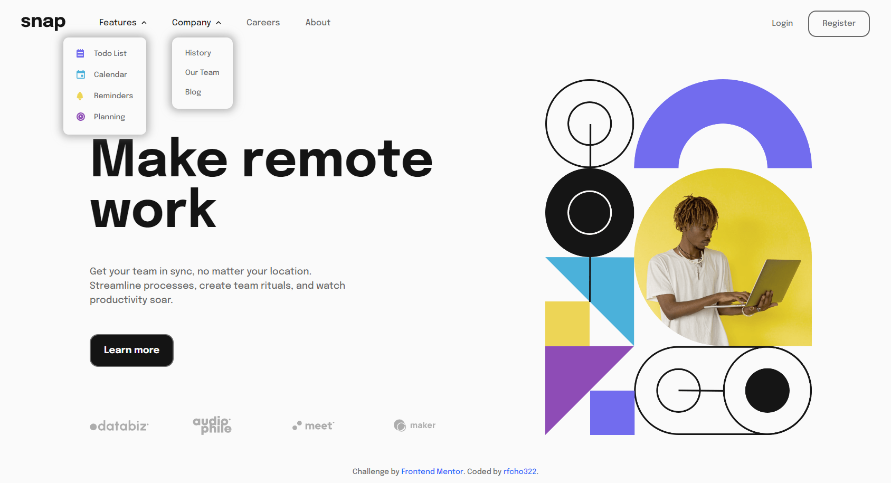
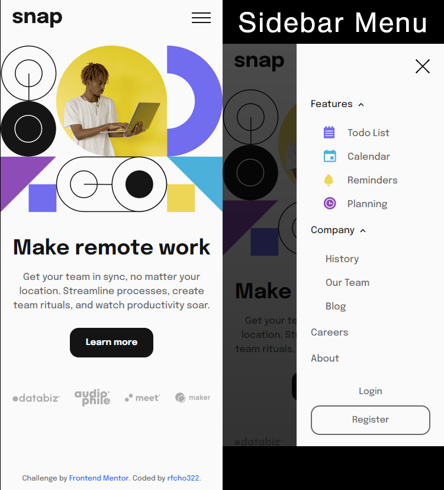

# Frontend Mentor - Intro section with dropdown navigation solution

This is a solution to the [Intro section with dropdown navigation challenge on Frontend Mentor](https://www.frontendmentor.io/challenges/intro-section-with-dropdown-navigation-ryaPetHE5).

## Table of contents

- [Overview](#overview)
  - [The challenge](#the-challenge)
  - [Screenshot](#screenshot)
  - [Links](#links)
- [My process](#my-process)
  - [Built with](#built-with)
  - [What I learned](#what-i-learned)
  - [Continued development](#continued-development)
  - [Useful resources](#useful-resources)
- [Author](#author)
- [Acknowledgments](#acknowledgments)

## Overview

### The challenge

Users should be able to:

- &#9989; View the relevant dropdown menus on desktop and mobile when interacting with the navigation links
- &#9989; View the optimal layout for the content depending on their device's screen size
- &#9989; See hover states for all interactive elements on the page

### Screenshot

  <strong>Desktop</strong>

  

  <strong>Mobile</strong>

  

### Links

- Frontend Mentor solution URL: [Intro Section with Dropdown Navigation Solution]()
- Live Site URL: [Intro Section with Dropdown Navigation Live Website]()

## My process

### Built with

- Semantic HTML5 markup
- CSS custom properties
- Flexbox
- CSS Grid
- JavaScript
- Mobile-first workflow

### What I learned

I've to learn Aria (Accessible Rich Internet Applications) because it provides a way to make web content more accessible to people with disabilities, including those who are blind or visually impaired, deaf or hard of hearing, and have physical or cognitive disabilities. Aria defines a set of attributes and roles that can be added to HTML elements to make them more accessible by providing additional information to assistive technologies such as screen readers, which can then convey that information to users. By using Aria, web developers can create more inclusive and accessible websites and applications that can be used by a wider audience.

Here are the ARIA attributes that I used in this website:

1. **aria-label** - This attribute is used to provide a label for a non-text element such as an icon or image.

2. **aria-labelledby** - This attribute is used to provide a label for an element using the ID of another element on the same page

3. **aria-expanded** - Used to indicate the current state of an expandable element, such as a dropdown menu or accordion.

4. **role** - Used to define the role of an element, such as button, link, navigation, or menu.

5. **aria-haspopup** - This attribute indicates the presence of a popup element, such as a dropdown menu, associated with a button or link. It can improve the accessibility of interactive elements by providing additional information about their functionality to assistive technologies, making them easier to use for people with disabilities.

### Useful resources

- [ARIA states and properties](https://developer.mozilla.org/en-US/docs/Web/Accessibility/ARIA/Attributes) - ARIA (Accessible Rich Internet Applications) states and properties are attributes that can be added to HTML elements to provide additional information about their functionality and behavior to assistive technologies such as screen readers. Using ARIA states and properties can help make web content more accessible to people with disabilities by providing context and information that may not be evident from the visual presentation alone.

## Author

- Frontend Mentor - [@rfcho322](https://www.frontendmentor.io/profile/rfcho322)
